# 🎵 MusicApp

Application Android de recherche musicale développée en ≈ 4 jours.  
_API
utilisée : [iTunes Search API](https://developer.apple.com/library/archive/documentation/AudioVideo/Conceptual/iTuneSearchAPI/Searching.html#//apple_ref/doc/uid/TP40017632-CH5-SW1)_

---

## 📱 États UI de la recherche

L’écran de recherche gère explicitement tous les états clés de l’UI: inactif, chargement, résultat
vide, et erreur.

| Idle                                          | Loading                                             | No Result                                              | Error                                           |
|-----------------------------------------------|-----------------------------------------------------|--------------------------------------------------------|-------------------------------------------------|
| 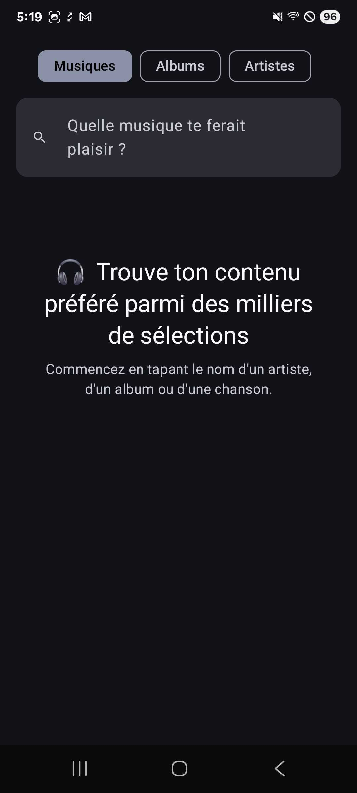 | 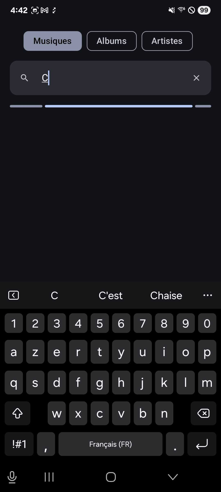 | 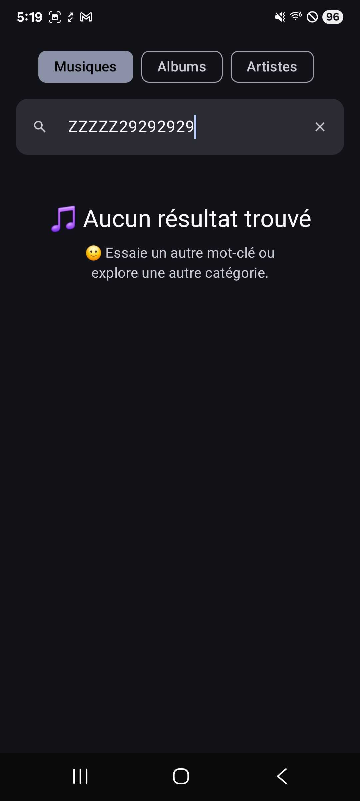 | 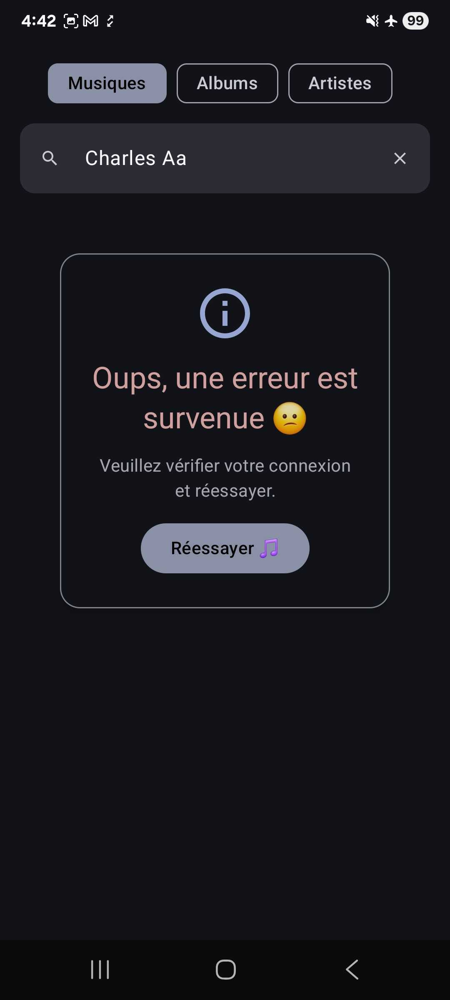 |

---

## 📄 États UI de la pagination et des résultats

Aperçu des états clés liés à la pagination et à l’affichage des résultats:

| Résultat de recherche                                    | Pagination : Loader                                              | Pagination : Fin                                                 | Pagination : Erreur                                            |
|----------------------------------------------------------|------------------------------------------------------------------|------------------------------------------------------------------|----------------------------------------------------------------|
| 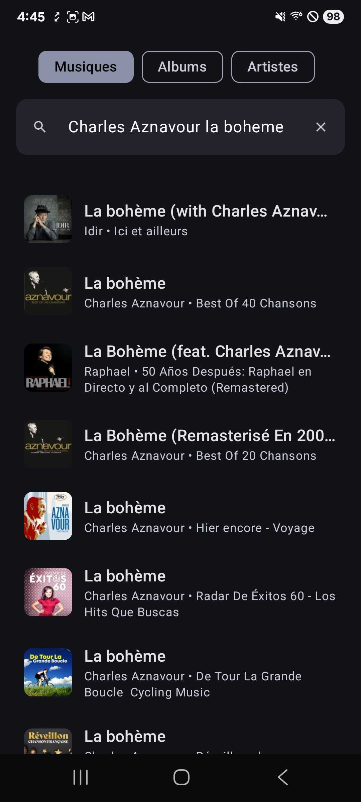 | 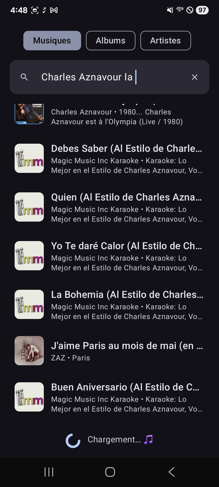 | 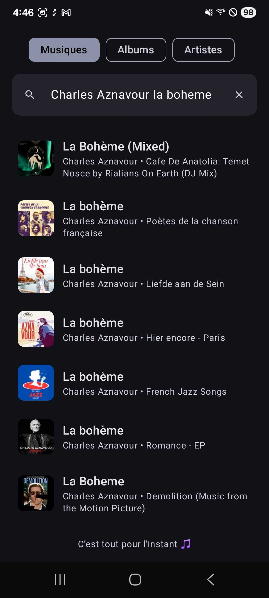 | 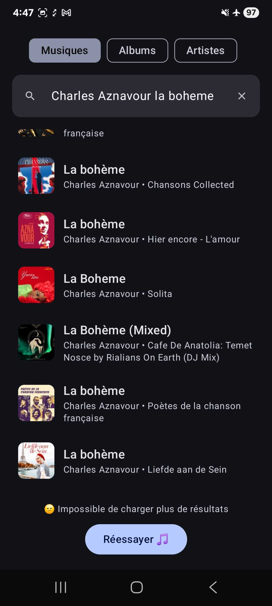 |

---

## 🎧 États UI du player audio

Aperçu des états principaux du player intégré (SongDetails):

| Idle                                          | Loader                                            | Playing                                             | Pause                                           |
|-----------------------------------------------|---------------------------------------------------|-----------------------------------------------------|-------------------------------------------------|
| 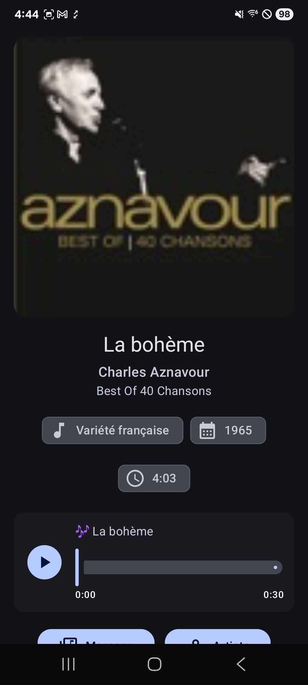 | 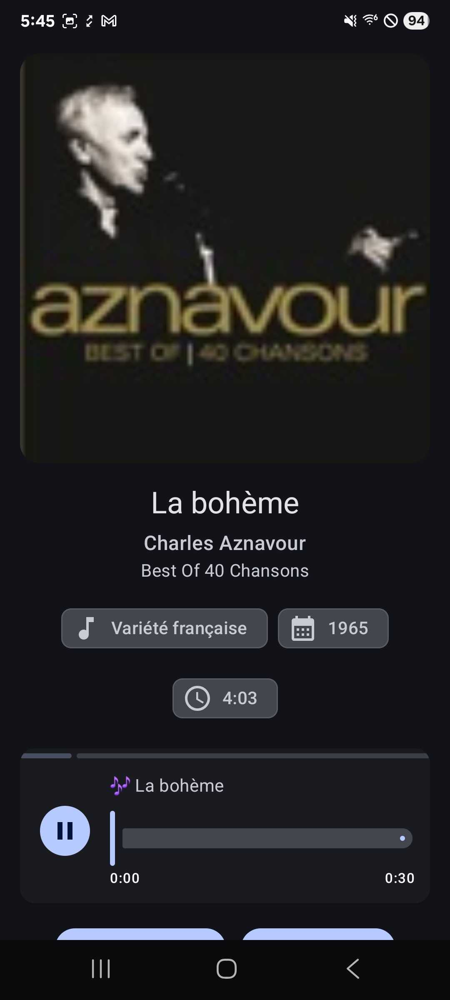 | 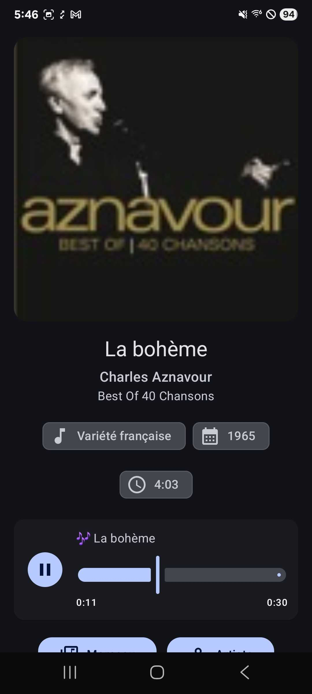 | 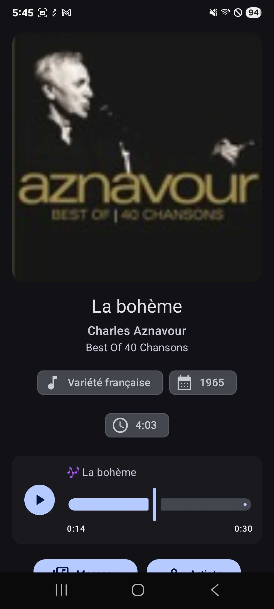 |

| Replay                                            | Error                                           | Loader after Retry                                                        |
|---------------------------------------------------|-------------------------------------------------|---------------------------------------------------------------------------|
| 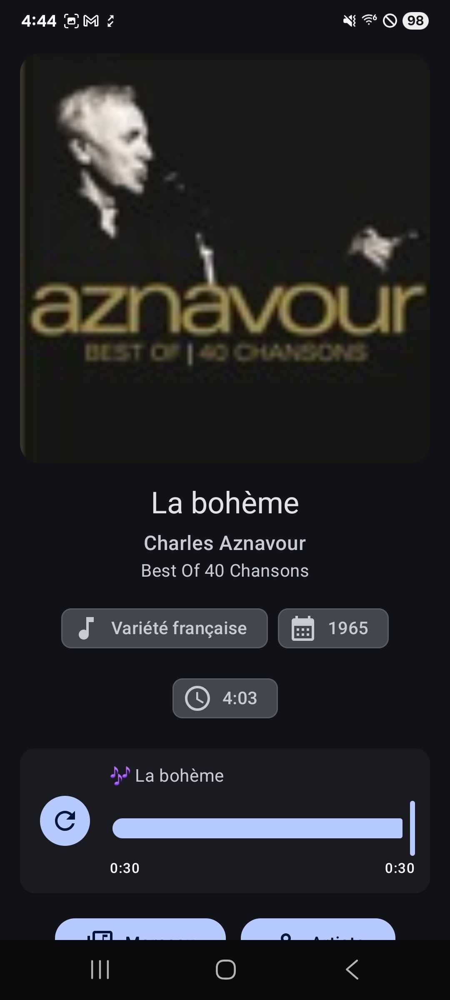 | 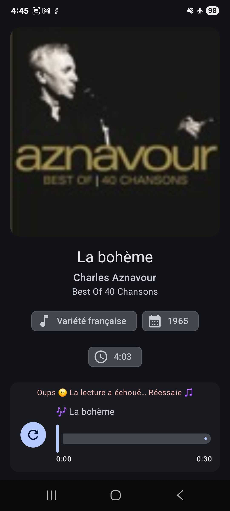 | 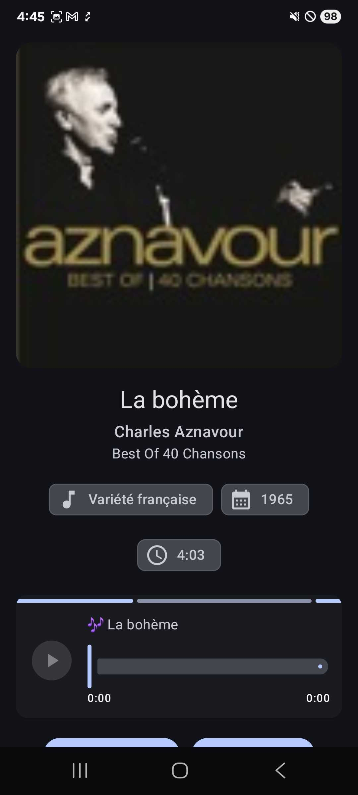 |

---

## 🏛️ Architecture & Stack

- **MVVM + Clean Architecture** (UseCases, Repository, Feature)
- **UI** : Jetpack Compose (Material3, animations, state hoisting)
- **Navigation** : Jetpack Navigation Compose
- **DI** : Hilt (ViewModelScoped, Singleton…)
- **Audio Player** : ExoPlayer encapsulé via `MusicPlayerController` (interface testable)
- **Asynchronicité** : Kotlin Coroutines, Flow, SavedStateHandle & getStateFlow (process-death safe)
- **Sérialisation** : kotlinx.serialization

---

## 📦 Modularisation

- **`app`**  
  Hôte UI & navigation (Jetpack Compose).  
  Contient les écrans _Search_, _SongDetails_, _AlbumDetails_, _ArtistDetails_ et orchestre la
  jonction **ViewModel ↔
  UseCases**.  
  _Dépend de_ : `domains`, `repositories`.

- **`domains`**  
  Logique métier **pure** : entités, use cases, contrats de repository.  
  **Aucune dépendance Android** → module 100 % JVM/KMP-friendly.

- **`repositories`**  
  Accès aux données : implémentations des contrats (appels réseau iTunes, mapping DTO → domain).  
  _Dépend de_ : `domains`.

**Chaque module est entièrement testé.**

---

## ⚙️ Gradle

- Gradle KTS avec `libs.versions.toml` (catalogue de versions centralisé)
- Plugins : Hilt, KSP, Kotlinx-Serialization
- Support de `testFixtures` pour partager les modèles de test

> 🛠️ **Configuration centralisée**  
> Tous les paramètres communs (SDK, JVM, runners, Compose…) sont définis à la racine pour :
> - Éviter toute duplication
> - Garantir l’homogénéité
> - Simplifier la maintenance

---

## ✅ Testing

- **Unit tests 100 % isolés (JVM), Turbine sur StateFlow:**
    - ViewModels testés avec des **Fakes** pour les UseCases et Repositories
    - UseCases et Repositories testés de façon indépendante
    - Player audio (`MusicPlayerController`) testé avec un **Fake** (simulateur d’ExoPlayer)
- **Cas métier couverts** :
    - **Général** : succès, erreur, loading, retry
    - **Pagination** : fin de liste, erreurs, doublons, loading, retry
    - **Player audio** : seek, replay, loading, idempotence, release

---

## ✨ Features

- Recherche de **chansons, albums, artistes** (API iTunes)
- Navigation multi-écrans fluide
- **Pagination** : gestion manuelle de l’offset, des erreurs, de la limite de résultats et
  filtrage des doublons côté client (API non idempotente)
- **Animations légères** : crossfade sur transitions et listes
- **SongDetails** : player audio, timeline interactive, titre animé, liens externes
- **AlbumDetails** : pochette, genre, année, copyright, liens Apple Music
- **ArtistDetails** : infos de base + redirection
- **Gestion complète des états UI** : loading, erreur, idle, retry, pour la recherche et la
  pagination

## 🚀 Axes d’amélioration

- **UX & Fonctionnel**
    - Pager pour le swipe entre catégories, persistance d’état
    - Gestion des favoris (sauvegarde locale avec Room)
    - Historique des 10 dernières recherches (sauvegarde locale avec Room)
    - Écrans de détails enrichis : API additionnelles (plus d’infos, plus de contenus, qualité photo
      accrue)
- **Technique**
    - Lecture audio en background (MediaSessionService)
    - Gestion fine des erreurs réseau (messages adaptés à l’utilisateur, gestion du mode avion,
      reconnection
      automatique)
- **Architecture & Build**
    - Modulaire : extraction de nouveaux modules “features” au besoin
    - Gradle build logic : factorisation avancée via plugins custom

---